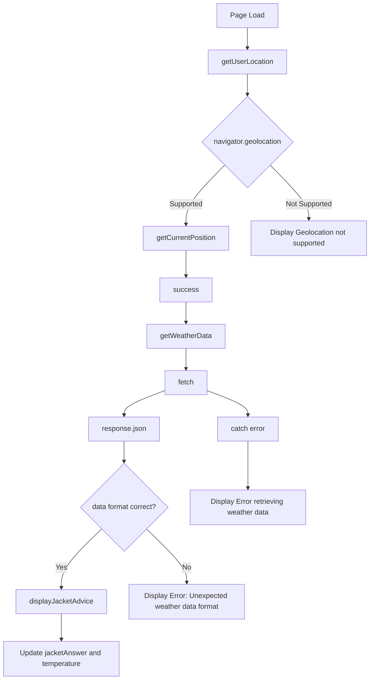

Sure, let's break down the file into the specified sections and explain each part in detail.

## Basic Structure

The basic structure of an HTML file includes the `<!DOCTYPE html>`, `<html>`, `<head>`, and `<body>` tags. These tags define the document type and the main sections of the HTML document.

### Basic Structure Code
```html
<!DOCTYPE html>
<html lang="en">
  <head>
    <meta charset="UTF-8" />
    <meta name="viewport" content="width=device-width, initial-scale=1.0" />
    <title>Jacket or Not?</title>
  </head>
  <body>
    <!-- App div and script will be here -->
  </body>
</html>
```

### Explanation
- `<!DOCTYPE html>`: Declares the document type and version of HTML.
- `<html lang="en">`: The root element of the HTML document, with the language set to English.
- `<head>`: Contains meta-information about the document, such as character set, viewport settings, and the title.
  - `<meta charset="UTF-8" />`: Specifies the character encoding for the document.
  - `<meta name="viewport" content="width=device-width, initial-scale=1.0" />`: Ensures the page is responsive on all devices.
  - `<title>Jacket or Not?</title>`: Sets the title of the webpage, which appears in the browser tab.
- `<body>`: Contains the content of the HTML document that will be displayed in the browser.

## HTML of the App Div

The app div contains the main content of the application, including the container, heading, and paragraph elements.

### Container Div
```html
<div class="container">
  <h1 id="jacketAnswer">Loading...</h1>
  <p id="temperature"></p>
</div>
```

### Explanation
- `<div class="container">`: A container div that groups the content and applies specific styles.
- `<h1 id="jacketAnswer">Loading...</h1>`: A heading element with an ID of [`jacketAnswer`](command:_github.copilot.openSymbolFromReferences?%5B%22%22%2C%5B%7B%22uri%22%3A%7B%22scheme%22%3A%22file%22%2C%22authority%22%3A%22%22%2C%22path%22%3A%22%2FC%3A%2FUsers%2Fjohnk%2Fgithub%2Fworkshops%2Fcoding%20with%20ai%2Fexamples%2Fjacket-or-not-app%2Fjacket-or-not-app.html%22%2C%22query%22%3A%22%22%2C%22fragment%22%3A%22%22%7D%2C%22pos%22%3A%7B%22line%22%3A36%2C%22character%22%3A14%7D%7D%5D%2C%2213f709d6-4016-4980-8c1e-a9598d17d323%22%5D "Go to definition"), initially displaying "Loading...".
- `<p id="temperature"></p>`: A paragraph element with an ID of [`temperature`](command:_github.copilot.openSymbolFromReferences?%5B%22%22%2C%5B%7B%22uri%22%3A%7B%22scheme%22%3A%22file%22%2C%22authority%22%3A%22%22%2C%22path%22%3A%22%2FC%3A%2FUsers%2Fjohnk%2Fgithub%2Fworkshops%2Fcoding%20with%20ai%2Fexamples%2Fjacket-or-not-app%2Fjacket-or-not-app.html%22%2C%22query%22%3A%22%22%2C%22fragment%22%3A%22%22%7D%2C%22pos%22%3A%7B%22line%22%3A37%2C%22character%22%3A13%7D%7D%5D%2C%2213f709d6-4016-4980-8c1e-a9598d17d323%22%5D "Go to definition"), initially empty, to display the temperature.

## CSS

The CSS section defines the styles for the HTML elements, including the body, container, heading, and paragraph.

### Body Styles
```css
body {
  font-family: Arial, sans-serif;
  text-align: center;
  background-color: #000000;
  color: #ffffff;
  padding: 50px;
}
```

### Explanation
- `font-family: Arial, sans-serif;`: Sets the font family to Arial or a sans-serif font.
- `text-align: center;`: Centers the text horizontally.
- `background-color: #000000;`: Sets the background color to black.
- `color: #ffffff;`: Sets the text color to white.
- `padding: 50px;`: Adds padding around the body content.

### Container Styles
```css
.container {
  background-color: black;
  padding: 20px;
  border-radius: 10px;
  box-shadow: 0 0 15px rgba(255, 255, 255, 0.1);
  display: inline-block;
}
```

### Explanation
- `background-color: black;`: Sets the background color of the container to black.
- `padding: 20px;`: Adds padding inside the container.
- `border-radius: 10px;`: Rounds the corners of the container.
- `box-shadow: 0 0 15px rgba(255, 255, 255, 0.1);`: Adds a subtle white shadow around the container.
- `display: inline-block;`: Makes the container an inline-block element.

### Heading Styles
```css
h1 {
  font-size: 2.5rem;
  margin-bottom: 20px;
}
```

### Explanation
- `font-size: 2.5rem;`: Sets the font size of the heading to 2.5 rem units.
- `margin-bottom: 20px;`: Adds a margin below the heading.

### Paragraph Styles
```css
p {
  font-size: 1.25rem;
}
```

### Explanation
- `font-size: 1.25rem;`: Sets the font size of the paragraph to 1.25 rem units.

## JavaScript

The JavaScript section contains functions that handle geolocation, fetch weather data, and update the page with jacket advice.

### getUserLocation Function
```javascript
function getUserLocation() {
  if (navigator.geolocation) {
    navigator.geolocation.getCurrentPosition(success, error);
  } else {
    document.getElementById("jacketAnswer").textContent =
      "Geolocation not supported by your browser.";
  }
}
```

### Explanation
- Checks if the browser supports geolocation.
- If supported, requests the user's location and calls the [`success`](command:_github.copilot.openSymbolFromReferences?%5B%22%22%2C%5B%7B%22uri%22%3A%7B%22scheme%22%3A%22file%22%2C%22authority%22%3A%22%22%2C%22path%22%3A%22%2FC%3A%2FUsers%2Fjohnk%2Fgithub%2Fworkshops%2Fcoding%20with%20ai%2Fexamples%2Fjacket-or-not-app%2Fjacket-or-not-app.html%22%2C%22query%22%3A%22%22%2C%22fragment%22%3A%22%22%7D%2C%22pos%22%3A%7B%22line%22%3A45%2C%22character%22%3A51%7D%7D%5D%2C%2213f709d6-4016-4980-8c1e-a9598d17d323%22%5D "Go to definition") function on success or the [`error`](command:_github.copilot.openSymbolFromReferences?%5B%22%22%2C%5B%7B%22uri%22%3A%7B%22scheme%22%3A%22file%22%2C%22authority%22%3A%22%22%2C%22path%22%3A%22%2FC%3A%2FUsers%2Fjohnk%2Fgithub%2Fworkshops%2Fcoding%20with%20ai%2Fexamples%2Fjacket-or-not-app%2Fjacket-or-not-app.html%22%2C%22query%22%3A%22%22%2C%22fragment%22%3A%22%22%7D%2C%22pos%22%3A%7B%22line%22%3A45%2C%22character%22%3A60%7D%7D%5D%2C%2213f709d6-4016-4980-8c1e-a9598d17d323%22%5D "Go to definition") function on failure.
- If not supported, displays an error message.

### success Function
```javascript
function success(position) {
  const lat = position.coords.latitude;
  const lon = position.coords.longitude;
  getWeatherData(lat, lon);
}
```

### Explanation
- Extracts the latitude and longitude from the user's position.
- Calls the [`getWeatherData`](command:_github.copilot.openSymbolFromReferences?%5B%22%22%2C%5B%7B%22uri%22%3A%7B%22scheme%22%3A%22file%22%2C%22authority%22%3A%22%22%2C%22path%22%3A%22%2FC%3A%2FUsers%2Fjohnk%2Fgithub%2Fworkshops%2Fcoding%20with%20ai%2Fexamples%2Fjacket-or-not-app%2Fjacket-or-not-app.html%22%2C%22query%22%3A%22%22%2C%22fragment%22%3A%22%22%7D%2C%22pos%22%3A%7B%22line%22%3A59%2C%22character%22%3A8%7D%7D%5D%2C%2213f709d6-4016-4980-8c1e-a9598d17d323%22%5D "Go to definition") function with the coordinates.

### error Function
```javascript
function error() {
  document.getElementById("jacketAnswer").textContent =
    "Unable to retrieve your location.";
}
```

### Explanation
- Displays an error message if the location retrieval fails.

### getWeatherData Function
```javascript
function getWeatherData(lat, lon) {
  const apiUrl = `https://api.open-meteo.com/v1/forecast?latitude=${lat}&longitude=${lon}&daily=temperature_2m_max`;

  fetch(apiUrl)
    .then((response) => response.json())
    .then((data) => {
      if (data && data.daily && data.daily.temperature_2m_max) {
        const temp = data.daily.temperature_2m_max[0];
        displayJacketAdvice(temp);
      } else {
        document.getElementById("jacketAnswer").textContent =
          "Error: Unexpected weather data format.";
      }
    })
    .catch(() => {
      document.getElementById("jacketAnswer").textContent =
        "Error retrieving weather data.";
    });
}
```

### Explanation
- Constructs the API URL with the user's coordinates.
- Fetches weather data from the OpenMeteo API.
- Parses the response as JSON.
- Checks if the data format is correct and extracts the temperature.
- Calls the [`displayJacketAdvice`](command:_github.copilot.openSymbolFromReferences?%5B%22%22%2C%5B%7B%22uri%22%3A%7B%22scheme%22%3A%22file%22%2C%22authority%22%3A%22%22%2C%22path%22%3A%22%2FC%3A%2FUsers%2Fjohnk%2Fgithub%2Fworkshops%2Fcoding%20with%20ai%2Fexamples%2Fjacket-or-not-app%2Fjacket-or-not-app.html%22%2C%22query%22%3A%22%22%2C%22fragment%22%3A%22%22%7D%2C%22pos%22%3A%7B%22line%22%3A81%2C%22character%22%3A14%7D%7D%5D%2C%2213f709d6-4016-4980-8c1e-a9598d17d323%22%5D "Go to definition") function with the temperature.
- Displays an error message if the data format is unexpected or the fetch fails.

### displayJacketAdvice Function
```javascript
function displayJacketAdvice(temp) {
  let advice = "";
  let color = "";

  if (temp < 5) {
    advice = "Yes, wear a winter coat!";
    color = "cyan";
  } else if (temp < 15) {
    advice = "You'll need a jacket.";
    color = "indigo";
  } else if (temp < 25) {
    advice = "A light sweater or hoodie should do.";
    color = "blue";
  } else {
    advice = "No jacket needed, it's warm!";
    color = "magenta";
  }

  const jacketAnswerElement = document.getElementById("jacketAnswer");
  jacketAnswerElement.textContent = advice;
  jacketAnswerElement.style.color = color;
  document.getElementById("temperature").textContent = `It's currently ${temp}°C.`;
}
```

### Explanation
- Determines jacket advice based on the temperature.
- Sets the advice text and color based on temperature ranges.
- Updates the [`jacketAnswer`](command:_github.copilot.openSymbolFromReferences?%5B%22%22%2C%5B%7B%22uri%22%3A%7B%22scheme%22%3A%22file%22%2C%22authority%22%3A%22%22%2C%22path%22%3A%22%2FC%3A%2FUsers%2Fjohnk%2Fgithub%2Fworkshops%2Fcoding%20with%20ai%2Fexamples%2Fjacket-or-not-app%2Fjacket-or-not-app.html%22%2C%22query%22%3A%22%22%2C%22fragment%22%3A%22%22%7D%2C%22pos%22%3A%7B%22line%22%3A36%2C%22character%22%3A14%7D%7D%5D%2C%2213f709d6-4016-4980-8c1e-a9598d17d323%22%5D "Go to definition") element with the advice and color.
- Updates the [`temperature`](command:_github.copilot.openSymbolFromReferences?%5B%22%22%2C%5B%7B%22uri%22%3A%7B%22scheme%22%3A%22file%22%2C%22authority%22%3A%22%22%2C%22path%22%3A%22%2FC%3A%2FUsers%2Fjohnk%2Fgithub%2Fworkshops%2Fcoding%20with%20ai%2Fexamples%2Fjacket-or-not-app%2Fjacket-or-not-app.html%22%2C%22query%22%3A%22%22%2C%22fragment%22%3A%22%22%7D%2C%22pos%22%3A%7B%22line%22%3A37%2C%22character%22%3A13%7D%7D%5D%2C%2213f709d6-4016-4980-8c1e-a9598d17d323%22%5D "Go to definition") element with the current temperature.

### Example Call Traces
1. `getUserLocation()` is called when the page loads.
2. `navigator.geolocation.getCurrentPosition(success, error)` requests the user's location.
3. On success, `success(position)` is called with the user's position.
4. `getWeatherData(lat, lon)` is called with the user's coordinates.
5. `fetch(apiUrl)` sends a request to the OpenMeteo API.
6. On successful response, `displayJacketAdvice(temp)` is called with the temperature.
7. `displayJacketAdvice(temp)` updates the page with jacket advice and temperature.

### Mermaid Chart


This detailed walkthrough should help a true novice understand each part of the HTML file, from the basic structure to the CSS and JavaScript functions.

---

Prompt used to generate this walkthrough: 
- the full text of the `jacket-or-not-app.html` file +
- the following chat prompt: 
```prompt
give me a detailed walkthrough of this file for a true novice. Every line must be addressed, though chunking it up is also useful. 

There will be four sections: 
- Basic Structure
  - this is everything that is NOT the things in the next three sections, so things like the header, the metadata, the <body> tag, etc. Snip out:
    - the css at the top
    - the html structure of the actual app div
    - the js functions we defined
- HTML of the app div:
  - explain what each element does, in separate code fences. 
- CSS:
  - what each block is doing to the style on the page
- JS:
  - what each function does, again, in detail. 
  - then write some example call traces of the order in which functions might occur, 
  - then finally end with a mermaid chart that captures the data flow. 

Write the whole thing in markdown, with some light connective tissue between each section, helping guide the reader's attention.
```  
