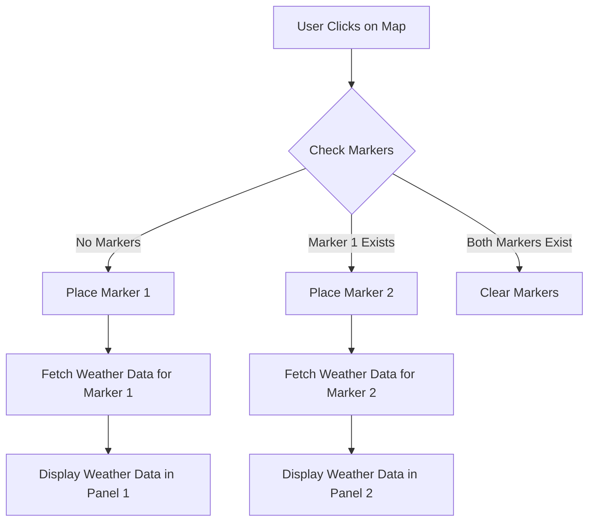

Sure, let's break down the file into the four sections as requested. This will help you understand each part of the HTML, CSS, and JavaScript in detail.

## Basic Structure

The basic structure of an HTML file includes the `<!DOCTYPE html>`, `<html>`, `<head>`, and `<body>` tags. These tags define the overall structure of the document.

```html
<!DOCTYPE html>
<html lang="en">
  <head>
    <meta charset="UTF-8" />
    <meta name="viewport" content="width=device-width, initial-scale=1.0" />
    <title>Weather Comparison Tool</title>
  </head>
  <body>
    <!-- Content goes here -->
  </body>
</html>
```

### Explanation:
- `<!DOCTYPE html>`: Declares the document type and version of HTML.
- `<html lang="en">`: The root element of the HTML document, with the language set to English.
- `<head>`: Contains meta-information about the document, such as character set, viewport settings, and the title.
- `<meta charset="UTF-8" />`: Specifies the character encoding for the document.
- `<meta name="viewport" content="width=device-width, initial-scale=1.0" />`: Ensures the page is responsive and scales correctly on different devices.
- `<title>Weather Comparison Tool</title>`: Sets the title of the document, which appears in the browser tab.
- `<body>`: Contains the content of the document that will be displayed in the browser.

## HTML of the Weather-App containers

This section includes the HTML elements that make up the weather comparison tool.

### Map Container
```html
<div id="map"></div>
```
- `<div id="map"></div>`: A container for the map. The `id="map"` is used to reference this element in the CSS and JavaScript.

### Weather Comparison Panels
```html
<div id="weather-container">
  <div id="weather-panel-1" class="weather-panel">
    <!-- Weather data for location 1 will be displayed here -->
  </div>
  <div id="weather-panel-2" class="weather-panel">
    <!-- Weather data for location 2 will be displayed here -->
  </div>
</div>
```
- `<div id="weather-container">`: A container for the weather comparison panels.
- `<div id="weather-panel-1" class="weather-panel">`: A panel for displaying weather data for the first location.
- `<div id="weather-panel-2" class="weather-panel">`: A panel for displaying weather data for the second location.

## CSS

The CSS styles define the appearance of the HTML elements.

### Body Style
```css
body {
  background: linear-gradient(to right, #ff00cc, #333399);
  font-family: "Courier New", Courier, monospace;
  color: #fff;
  margin: 0;
  padding: 0;
  overflow-x: hidden;
}
```
- Sets a gradient background, font family, text color, and removes default margin and padding. Prevents horizontal scrolling.

### Map Style
```css
#map {
  width: 100%;
  height: 400px;
  opacity: 0;
  animation: fadeIn 2s forwards;
}
```
- Sets the map container to full width, 400px height, and applies a fade-in animation.

### Weather Panel Style
```css
.weather-panel {
  width: 48%;
  display: inline-block;
  vertical-align: top;
  padding: 20px;
  box-sizing: border-box;
  background: rgba(255, 255, 255, 0.1);
  border-radius: 10px;
  margin: 10px 0;
  opacity: 0;
  animation: fadeIn 2s forwards;
  animation-delay: 1s;
}
```
- Styles the weather panels with width, padding, background color, border radius, margin, and fade-in animation.

### Weather Container Style
```css
#weather-container {
  display: flex;
  justify-content: space-between;
  padding: 20px;
}
```
- Uses flexbox to arrange the weather panels and adds padding.

### Fade-In Animation
```css
@keyframes fadeIn {
  to {
    opacity: 1;
  }
}
```
- Defines a keyframe animation to fade in elements by changing their opacity.

### External CSS Import
```html
<link rel="stylesheet" href="https://unpkg.com/leaflet/dist/leaflet.css" />
```
- Imports the Leaflet CSS for map styling, ensuring the map looks correct.

## JavaScript

The JavaScript code adds interactivity to the page.

### Leaflet JS Import
```html
<script src="https://unpkg.com/leaflet/dist/leaflet.js"></script>
```
- Imports the Leaflet JavaScript library for map functionality.

### Initialize the Map
```js
var map = L.map("map").setView([20, 0], 2); // Centered on the world
```
- Initializes the map centered on the world with a zoom level of 2.

### Add OpenStreetMap Tiles
```js
L.tileLayer("https://{s}.tile.openstreetmap.org/{z}/{x}/{y}.png", {
  attribution: "&copy; OpenStreetMap contributors",
}).addTo(map);
```
- Adds OpenStreetMap tiles to the map with attribution.

### Variables to Store Markers
```js
var marker1, marker2;
```
- Declares variables to store the map markers.

### Handle Map Clicks
```js
map.on("click", function (e) {
  if (!marker1) {
    marker1 = L.marker(e.latlng).addTo(map);
    fetchWeatherData(e.latlng.lat, e.latlng.lng, "weather-panel-1");
  } else if (!marker2) {
    marker2 = L.marker(e.latlng).addTo(map);
    fetchWeatherData(e.latlng.lat, e.latlng.lng, "weather-panel-2");
  } else {
    clearMarkers();
  }
});
```
- Adds an event listener for map clicks to place markers and fetch weather data.

### Clear Markers and Weather Data
```js
function clearMarkers() {
  if (marker1) {
    map.removeLayer(marker1);
    marker1 = null;
    document.getElementById("weather-panel-1").innerHTML = "";
  }
  if (marker2) {
    map.removeLayer(marker2);
    marker2 = null;
    document.getElementById("weather-panel-2").innerHTML = "";
  }
}
```
- Removes markers and clears weather data from the panels.

### Get Emoji Weather Code
```js
function getEmojiWeatherCode(weatherCode) {
  switch (weatherCode) {
    case 0:
      return "☀️"; // clearsky_day
    case 1:
      return "🌙"; // clearsky_night
    case 2:
      return "🌤️"; // fewclouds_day
    case 3:
      return "🌙☁️"; // fewclouds_night
    case 45:
      return "🌥️"; // scatteredclouds_day
    case 48:
      return "🌙☁️"; // scatteredclouds_night
    case 51:
      return "☁️"; // brokenclouds_day
    case 53:
      return "🌙☁️"; // brokenclouds_night
    case 55:
      return "🌦️"; // shower_rain_day
    case 56:
      return "🌙🌧️"; // shower_rain_night
    case 61:
      return "🌧️"; // rain_day
    case 63:
      return "🌙🌧️"; // rain_night
    case 65:
      return "⛈️"; // thunderstorm_day
    case 66:
      return "🌙⛈️"; // thunderstorm_night
    case 67:
      return "❄️"; // snow_day
    case 71:
      return "🌙❄️"; // snow_night
    case 73:
      return "🌫️"; // mist_day
    case 75:
      return "🌙🌫️"; // mist_night
    default:
      return "🌍"; // default case
  }
}
```
- Converts weather codes from the OpenMeteo API to emoji representations.

### Fetch Weather Data
```js
function fetchWeatherData(lat, lon, panelId) {
  fetch(
    `https://api.open-meteo.com/v1/forecast?latitude=${lat}&longitude=${lon}&current_weather=true`
  )
    .then((response) => response.json())
    .then((data) => {
      document.getElementById(panelId).innerHTML = `
        <h3>Weather for (${lat.toFixed(2)}, ${lon.toFixed(2)})</h3>
        <p>Temperature: ${data.current_weather.temperature}°C</p>
        <p>Wind Speed: ${data.current_weather.windspeed} km/h</p>
        <p>Weather: ${getEmojiWeatherCode(data.current_weather.weathercode)}</p>
      `;
    })
    .catch((error) => {
      console.error("Error fetching weather data:", error);
    });
}
```
- Fetches weather data from the OpenMeteo API and displays it in the specified panel.

### Example Call Traces
1. User clicks on the map for the first time:
   - `map.on("click")` -> places [`marker1`](command:_github.copilot.openSymbolFromReferences?%5B%22%22%2C%5B%7B%22uri%22%3A%7B%22scheme%22%3A%22file%22%2C%22authority%22%3A%22%22%2C%22path%22%3A%22%2FC%3A%2FUsers%2Fjohnk%2Fgithub%2Fworkshops%2Fcoding%20with%20ai%2Fjacket-or-not-video.html%22%2C%22query%22%3A%22%22%2C%22fragment%22%3A%22%22%7D%2C%22pos%22%3A%7B%22line%22%3A75%2C%22character%22%3A10%7D%7D%5D%2C%22d603e5df-05ef-425b-bde3-b276ad642907%22%5D "Go to definition") -> calls `fetchWeatherData()` for [`weather-panel-1`](command:_github.copilot.openSymbolFromReferences?%5B%22%22%2C%5B%7B%22uri%22%3A%7B%22scheme%22%3A%22file%22%2C%22authority%22%3A%22%22%2C%22path%22%3A%22%2FC%3A%2FUsers%2Fjohnk%2Fgithub%2Fworkshops%2Fcoding%20with%20ai%2Fjacket-or-not-video.html%22%2C%22query%22%3A%22%22%2C%22fragment%22%3A%22%22%7D%2C%22pos%22%3A%7B%22line%22%3A55%2C%22character%22%3A15%7D%7D%5D%2C%22d603e5df-05ef-425b-bde3-b276ad642907%22%5D "Go to definition").
2. User clicks on the map for the second time:
   - `map.on("click")` -> places [`marker2`](command:_github.copilot.openSymbolFromReferences?%5B%22%22%2C%5B%7B%22uri%22%3A%7B%22scheme%22%3A%22file%22%2C%22authority%22%3A%22%22%2C%22path%22%3A%22%2FC%3A%2FUsers%2Fjohnk%2Fgithub%2Fworkshops%2Fcoding%20with%20ai%2Fjacket-or-not-video.html%22%2C%22query%22%3A%22%22%2C%22fragment%22%3A%22%22%7D%2C%22pos%22%3A%7B%22line%22%3A75%2C%22character%22%3A19%7D%7D%5D%2C%22d603e5df-05ef-425b-bde3-b276ad642907%22%5D "Go to definition") -> calls `fetchWeatherData()` for [`weather-panel-2`](command:_github.copilot.openSymbolFromReferences?%5B%22%22%2C%5B%7B%22uri%22%3A%7B%22scheme%22%3A%22file%22%2C%22authority%22%3A%22%22%2C%22path%22%3A%22%2FC%3A%2FUsers%2Fjohnk%2Fgithub%2Fworkshops%2Fcoding%20with%20ai%2Fjacket-or-not-video.html%22%2C%22query%22%3A%22%22%2C%22fragment%22%3A%22%22%7D%2C%22pos%22%3A%7B%22line%22%3A58%2C%22character%22%3A15%7D%7D%5D%2C%22d603e5df-05ef-425b-bde3-b276ad642907%22%5D "Go to definition").
3. User clicks on the map for the third time:
   - `map.on("click")` -> calls `clearMarkers()` -> removes both markers and clears weather data.

### Mermaid Chart



This detailed walkthrough should help you understand each part of the HTML, CSS, and JavaScript in the file.

---

Prompt used to generate this walkthrough: 
- the full text of the `weather-comparison-app.html` file +
- the following chat prompt: 
```prompt
give me a detailed walkthrough of this file for a true novice. Every line must be addressed, though chunking it up is also useful. 

There will be four sections: 
- Basic Structure
  - this is everything that is NOT the things in the next three sections, so things like the header, the metadata, the <body> tag, etc. Snip out:
    - the css at the top (including the import)
    - the html structure of the actual app div
    - the js functions we defined (also including the import)
- HTML of the weather-app div:
  - explain what each element does, in separate code fences. 
- CSS:
  - what each block is doing to the style on the page
  - also why we import the external css
- JS:
  - what each function does, again, in detail. 
  - what the import does
  - then write some example call traces of the order in which functions might occur, 
  - then finally end with a mermaid chart that captures the data flow. 

Write the whole thing in markdown, with some light connective tissue between each section, helping guide the reader's attention.
```  

Generation note: 
- MAN it struggled with the Mermaid chart. Mainly it kept trying to use `()` in names, which Mermaid doesn't support. 
	- it was looking at the names of the functions, so, understandable mistake

